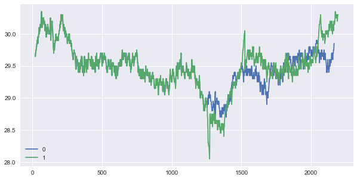

# Market simulation
## This module allows you to simulate financial markets. 
## You can easily initiate order-based markets, add agents with various strategies, and evaluate the actions of agents on measures such as volatility, profits and more.

## Introduction

It all starts with initiating one or more markets, and adding agents to the market(s).

When the orderGenerator is started, agents start sending orders to the market (according to their strategy), which are in turn processed by a matching engine. If the order matches an order/orders of the opposite side (e.g. a bid price exceeds a sell price), a transaction will occur. Otherwise, the order will be added to the orderbook. 

By initiating markets with different setups (different ticksizes, for example) and different agents (many/few random agents, many/no market makers, parties arbritrating between markets, etc.) one can evaluate the impact on market quality (=price development, volatility, etc.) and agents positions and profits. 

One can see - for example - that adding a market maker to a market, will decrease volatility:


Adding a market maker with a position limit (= closes position when limit is reached), can lead to sudden price spikes. 

Compare the price development one the green market (which includes market makers with position limits) to the one in blue (without positions limits):



The difference between price developments appears to increase whenever the price is more trending. If leave this one for you to investigate ;).

## Why the project is useful
This project can be useful for at least three groups of people: trading firms, regulators and trading venues. 

### Trading firms
For the first, it can be used to test algorithmic trading strategies.

Although there is plenty of transaction data around to backtest strategies, transaction data by itself doesn't provide an accurate picture of any market.

In reality, orders will have market-impact, directly matching other orders (hence changing the price) or cause other market participants to change their behaviour.

In order to fully appreciate the effects of any trading strategy, one has to take into account this feedback. A dynamic order generation system is one way to do so.

Furthermore, the market simulator can allow parties to test their strategies under a wide range of conditions. One can set the market (the ticksize, for example), and test the results of strategies given various sets of agents.

One can also stress-test algorithms, making sure they don't have any negative side effects on the market, give any particular condition.

### Regulators
Regulators can test the effects of various combinations of algoritmic strategies on the financial markets. While two trading strategies might - one used without the other - have "good" results for the markets (i.e., decrease volatitliy, increase market depth, etc.), the combination of both might have unintentional (and negative) consequences.

Simulations can help regulators in testing under what condtions dangers might emerge, and how to mitigate them (for example: changing the proporitions of various trading strategies).

### Trading venues
Trading venues can use simulations to test the effects of features of their market (ticksize, number of agents, for example) on variables of interest (number of transactions, for example). There might turn out to be conditions under which the market is not as stable as expected. What would - for example - happen to liquidity if we add a whole bunch of trend following algorithms? Would they trigger agents with stop losses? And if so, what would be the net effect on the market? What are the worst case scenarious you have to prepare for?

Questions such as these could be investigated using this simulator.

## How users can get started with the project
Using the libary is simple. 

First: Download "orderGenerator_module.py" and save it on your Python path.

Secondly: Import the libary. 

```
from orderGenerator_module.py import *
``` 

Step 3: Create a market:

### Market

`a = market()`

Adding no parameters initializes a market with default parameters (= minimum allowed price = 1, maximum price = 100,
ticksize = 0.05, minimal quantity of any order = 1 and maximum quantity = 10).

You can change any of these parameters by putting any of them between brackets:

`a = market(minprice = 100, maxprice = 1000, ticksize = 1, minquantity = 10, maxquantity = 1000)`

Now you can start adding your agents:

For now, you can pick any of the following strategies (see Agent section for more details):
- randomUniform
- randomNormal
- randomLogNormal
- marketMaker
- simpleArbitrage

Each strategy has parameters you can customize.

In time you will be able to make your own strategies, using simple supporting functions. You can already do so by changing the code, of course.

Now: create some agents
```
agent1 = agent("randomLogNormal") # initialize agent1 with strategy "randomLogNormal"
agent2 = agent("randomLogNormal", buy_probability = 0.6) # initialize agent with strategy "randomLogNormal" that buys with probability 0.6 (and sells with probability 0.4). This causes an upwards tendency in the price.
agent3 = agent("bestBidOffer") # initialize agent2 with strategy "bestBidOffer" (= market maker)
agent4 = agent("bestBidOffer", position_limit = 100) # a market maker with position limit = 100

a.addAgents([agent1, agent2, agent3, agent4])
```

You could add many hundreds of agents (although it might slow down the generator):


Now, having a market with agents, you can start the market/have the various agents send in orders:

`b.orderGenerator()`


This functions loops through the market, through the agents, and have each agent execute its strategy. Once finished, it will repeat. It will do so for (by default) 1000 times. You can of course adjsut this number (and other parameters):

`b.orderGenerator(n = 100, clearAt = 10, printOrderbook = True, sleeptime = 5)`

Once the loop is finished, we can see the results:

`a.summary()`


This shows four graphs:
- Price over time
- Volatility over time
- Positions of each agent over time
- Realized profit of each agent over time

You can also just check the price by:

`a.plotPrice()`


You can see the orderbook by typing:

`a.showOrderbook()`


Or (viusally) by typing:

`a.showOrderbookH()`


### Agents
At this point in time, the following strategies are available:

#### randomUniform: 
- Agent randomly chooses to send in Buy or Sell Order
- Agent chooses randomly from a **uniform distribution** a price between minprice of market and maxprice market
- Agent chooses randomly from a uniform distribution a quantity between minquantity of market and maxquantity market

#### randomNormal: 
- Agent randomly chooses to send in Buy or Sell Order
- Agent chooses randomly from a **normal distribution** with mean = last price and standard deviation = 0.1
- Agent chooses randomly from a uniform distribution a quantity between minquantity of market and maxquantity market

#### randomLogNormal
- Agent randomly chooses to send in Buy or Sell Order
- Agent chooses randomly from a **lognormal distribution with underlying distribution having mean = 0 and standard deviation = 0.2**. It multiplies this value with the last price traded. Value gets rounded to nearest multiple of ticksize.
- Agent chooses randomly (from a uniform distribution) a quantity between minquantity of market and maxquantity market

#### marketMaker
The market maker always checks if he is best bid and best offer in the orderbook. If he is not, he will improve best bid by 1 tick or best offer by 1 tick (or both).

He will choose randomly (from a uniform distribution) a quantity between minquantity of market and maxquantity market

You can set various parameters at the marketMaker, such as position limits, meaning: if his accumulated position exceeds its limit, he will close its entire position at market. The opposite goes for a short position.

#### simpleArbitrage
You can have an agent arbitrating between two markets. Meaning: the agent will buy the best offer on marketA if its price is smaller than the price of best bid on marketB. He will - simultenously - sell at marketB.

This way the prices on marketA and marketB will stay quite similair.

In to order to use this agent, you need two markets:

```
a = market()
b = market()

agent1 = agent(2)
agent2 = agent(2)
agent3 = agent(4) # strategy 4 is simpleArbitrage between market a and b

# Add the agents
a.addAgents([agent1, agent3])
b.addAgents([agent2, agent3])

# Start the markets
a.orderGenerator(1000)
```

In the near future you can make your own agents buy using simple sets of instrunctions. 

In the near future you can also change more parameters to the agents strategies.

### Orders
If an agents sends in an order, the order will go through the matching engine. This follows the standard rules of a limit order book. Briefly: if the price of a bid order is higher than the price of best offer in the orderbook, there will be a transaction. If there is a remaining quantity left (= agent didn't buy all units he wanted), the engine will check for the next lowest offer. If there is, there will be a transaction. This will go on untill either the buyer bought all units he wanted, or there are no offers matching the bid price. In case of the later, the reimaing bid will be send to the orderbook.

The opposite goes for offers.

### Transaction
If an order matching an order of the opposite site a transaciton will occur.

## Where users can get help with your project
- You can add strategies 
- You can write  supporting functions that will allow users to create their own strategies
- Add your own cool ideas
